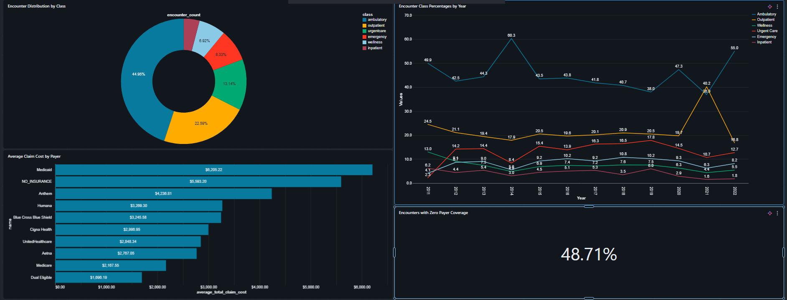

# 🏥 Hospital Records Analysis — Maven Analytics

An end-to-end data analytics project analyzing synthetic patient records from Massachusetts General Hospital. Built on top of the [Maven Analytics Hospital Analytics guided project](https://mavenanalytics.io/guided-projects/hospital-analytics) and extended with a full **Databricks** pipeline — including catalog setup, notebook analysis, and a live Databricks dashboard.

---

## The situation

You've just been hired as a Data Analyst for a healthcare analytics consulting firm that helps hospitals use data to improve patient care and reduce costs

You're working with Massachusetts General Hospital to help prepare their annual performance report

You've been asked to analyze patient encounters, costs, coverage, and behavior trends to support planning and improve care and operations

## 🎯 Project Objectives

This project analyzes hospital patient encounter data to surface key operational and clinical insights. Core questions explored include:

1. Encounters Overview: trends in encounter volume, types and lengths
- Which **procedures** are most frequent and most costly?
- What are the **demographic trends** across the patient population?

2. Cost & Coverage Insights: insurance coverage, procedures and claim costs
- Which **organizations** handle the highest patient volume?
- How does **payer coverage** relate to total claims and patient costs?

3. Patient Behavior Analysis: visit patterns, length of stay and readmissions
- How many patients have been **admitted or readmitted** over time?
- What is the average **length of stay** for patients?

---

## 📊 Dashboard Preview



---

## 📁 Project Structure

```
Hospital-Records-Analysis-MavenA/
│
├── .databricks/
│   └── commit_outputs          # Databricks commit metadata
│
├── Data/
│   ├── citation.txt                      # Dataset source citation
│   ├── data_dictionary.csv               # Field definitions for all tables
│   ├── encounters.csv                    # Patient encounter records
│   ├── organizations.csv                 # Hospital/organization data
│   ├── patients.csv                      # Patient demographics
│   ├── payers.csv                        # Insurance payer information
│   └── procedures.csv                    # Medical procedures performed
│
└── src/
    ├── catalog_setup.ipynb                        # Databricks Unity Catalog setup notebook
    ├── Hospital Records Dashboard.lvdash.json     # Databricks Lakeview dashboard definition
    ├── hospital_analytics_answers.ipynb           # Analysis notebook with answers & visualizations
    └── hospital_data_records_visualization.png    # Dashboard screenshot
```

---

## 🛠️ Tools & Technologies

| Tool | Purpose |
|---|---|
| **Databricks** | Cloud data platform for notebooks, SQL, and dashboards |
| **Unity Catalog** | Data governance and catalog management (`catalog_setup.ipynb`) |
| **Databricks Lakeview** | Interactive dashboard (`Hospital Records Dashboard.lvdash.json`) |
| **PySpark / SQL** | Data transformation and analytical queries |
| **Python** | Exploratory analysis and visualization |
| **CSV / Raw Data** | Source data from Maven Analytics (~75,592 records, 55 fields) |

---

## 🚀 Getting Started

### Prerequisites
- A Databricks workspace (Community Edition or higher)
- The `.databricks` config in this repo points to the associated workspace

### Steps

1. **Clone the repo**
   ```bash
   git clone https://github.com/Wabdulla04/Hospital-Records-Analysis-MavenA.git
   ```

2. **Set up the catalog**
   Open and run `src/catalog_setup.ipynb` in your Databricks workspace to initialize the Unity Catalog and load the data tables.

3. **Explore the analysis**
   Open `src/hospital_analytics_answers.ipynb` to walk through the analytical queries and visualizations.

4. **Load the dashboard**
   Import `src/Hospital Records Dashboard.lvdash.json` into Databricks as a Lakeview dashboard to view the interactive KPI report.

---

## 📦 Dataset

The dataset contains synthetic records for ~1,000 patients from Massachusetts General Hospital, with 75,592 records across 55 fields spanning 5 tables:

| Table | Description |
|---|---|
| `patients.csv` | Patient demographics (age, gender, location, etc.) |
| `encounters.csv` | Hospital visit records and encounter types |
| `procedures.csv` | Medical procedures performed per encounter |
| `payers.csv` | Insurance payer details |
| `organizations.csv` | Hospital and provider organization info |

> **Source:** [Maven Analytics — Hospital Patient Records](https://mavenanalytics.io/data-playground/hospital-patient-records)  
> See `Data/citation.txt` for full attribution.

---

## ✨ Extensions Beyond the Guided Project

While this project is rooted in the Maven Analytics Hospital Analytics guided project, it was uniquely extended by:

- **Databricks integration** — data loaded and governed via Unity Catalog rather than a local environment
- **Lakeview Dashboard** — a native Databricks dashboard built for executive-level KPI reporting, exportable as JSON

---

## 📄 License

Dataset provided by [Maven Analytics](https://mavenanalytics.io) for educational use. See `Data/citation.txt` for details.
